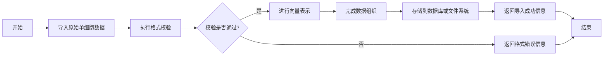
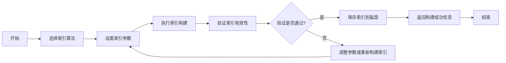
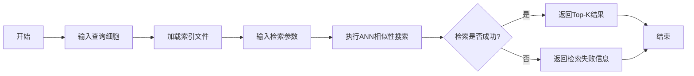
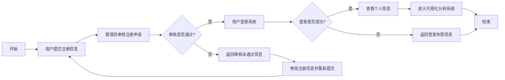
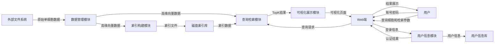

<!DOCTYPE html>
<html lang="zh-CN">
<head>
    <meta charset="UTF-8">
    <title>单细胞基因数据搜索工具需求报告</title>
</head>
<body>
    

        <h1>《单细胞基因数据搜索工具需求报告》</h1>
        
学号：2312147

        
姓名：彭振皓

    

</body>
</html>
## 引言

#### 编写目的：

本需求规格说明书旨在明确开发“单细胞基因数据搜索工具”项目的具体业务需求、功能模块和非功能性要求。本文档是系统开发、测试和验收的

#### 项目背景

针对大规模单细胞基因数据的搜索工具是生物信息学研究中的一项重要需求。本项目的核心目标是开发一个基于近似最近邻（ANN）搜索原理的、专门针对该类型数据的搜索工具。

由于单细胞转录组数据的规模日益扩大，传统的精确搜索方法（如精确线性搜索）在时间和计算资源上都无法满足需求。该项目的开发旨在利用 ANN 技术，为大数据的单细胞转录组提供有效的搜索、保存和比较能力，从而帮助研究人员更快速、更高效地分析和理解大规模单细胞数据

## 任务概述

本项目的目标是构建一个功能完整的系统，该系统能够：

1. 导入、组织和读取单细胞表达矩阵数据，并进行必要的预处理。
2. 构建、保存和加载高效的索引结构，支持对单细胞数据进行快速的相似性搜索。
3. 提供一个用户友好的查询界面，允许用户设置搜索参数（如 top-k 结果数），并执行高效的检索。
4. 将检索结果可视化展示给用户。
5. 提供基本的用户管理和系统访问控制

系统聚焦于生物信息学研究人员，需要高效的搜索工具来查找与其感兴趣的细胞相似的细胞，从而进行比较分析，他们熟悉生物数据，需要系统提供基本的参数调整功能，同时提供清晰简单的后台管理功能。

#### 假定与约束

**假定：** 用户拥有单细胞数据文件，并且对 Python 编程环境有基本的了解。

**约束：**系统可能基于 Python 和开源 ANN 库（如 Annoy, Faiss, 或 Hnswlib）构建。需要在标准硬件上运行，对于极其庞大的数据（例如千万级细胞），可能需要限制索引库的规模或使用更高配置的硬件。

## 业务描述

首先，系统管理员通过 Web 端上传原始单细胞表达矩阵数据，检索系统接收请求后调用预处理模块完成数据读取、格式校验以及向量化表示。随后，系统调用索引构建模块基于高维向量构建 ANN 检索索引，并将索引保存到磁盘。
 在检索阶段，研究人员通过 Web 端输入账号和密码登录系统。登录成功后，用户设置检索参数并输入查询细胞信息，Web 端将请求发送给检索系统。系统从磁盘加载索引后调用检索模块执行相似性搜索，并将返回的 top-k 检索结果交由结果展示模块进行可视化处理，最终在 Web 端展示给研究人员

#### 子业务流程

##### 数据管理流程活动图

数据管理流程主要用于完成原始单细胞数据的导入、校验、向量化表示以及存储管理。系统首先接收管理员导入的原始表达矩阵数据，然后对数据格式、字段完整性及数据合法性进行校验。若校验通过，则对单细胞数据进行向量化表示，并按照系统内部数据组织方式完成存储；若校验未通过，则返回错误信息并终止当前流程。

##### 索引构建流程活动图

索引构建流程主要实现检索索引的生成与持久化保存。系统首先根据业务需求选择索引算法，并设置相应参数，如索引维度、邻居数量或构建深度等。之后系统依据预处理后的向量数据执行索引构建，并对构建结果进行有效性验证。若验证通过，则将索引保存到磁盘；若验证失败，则重新调整参数或重新构建索引

##### **查询检索流程活动图**

查询检索流程用于实现用户对目标细胞的相似性搜索。用户首先输入待查询细胞信息，系统随后加载已构建完成的索引文件，并接收用户设置的检索参数，如 Top-K 数量、距离度量方式等。参数设置完成后，系统执行基于 ANN 的近似最近邻搜索，并将检索得到的 Top-K 结果返回给前端模块进行后续展示。

##### 可视化展示流程活动图

可视化展示流程用于对检索结果进行图形化呈现。系统首先接收查询模块返回的 Top-K 结果数据，然后根据结果数据计算可视化坐标，例如二维嵌入坐标或聚类分布坐标。随后生成对应的散点图、聚类图或其他可视化图表，并最终在前端 Web 页面中进行展示，以便用户直观分析相似细胞之间的关系

##### 用户信息管理流程活动图

用户信息管理流程用于实现用户注册、审核、登录及个人信息访问功能。新用户首先提交注册信息，管理员对其注册申请进行审核。若审核通过，则用户可以使用注册账号登录系统；若审核不通过，则需修改注册信息并重新提交。登录成功后，用户可查看个人信息，并进入系统执行后续检索与可视化分析操作。

## 数据需求

系统需要处理的主要数据是单细胞基因表达矩阵。

- **输入数据格式：** 例如 CSV、TSV，或专用的生物信息学格式（如 H5AD）。
- **数据内容：** 表达矩阵，其中行代表细胞（Cell），列代表基因（Gene），每个单元格是表达量。
- **索引文件：** 系统生成的索引库文件

系统数据流过程如下：首先，原始单细胞数据由外部文件系统输入至数据管理模块，经过格式校验、预处理及向量化后形成高维向量数据。该向量数据一方面传递至索引构建模块，用于生成索引文件并保存至磁盘索引库；另一方面传递至查询检索模块，作为检索对象的数据基础。
 在用户交互阶段，用户通过 Web 端输入账号密码，由用户信息模块完成身份认证与信息管理；用户输入查询细胞及检索参数后，请求被发送至查询检索模块。查询检索模块从磁盘索引库中加载索引数据，执行近似最近邻搜索，并输出 Top-K 检索结果。最后，可视化展示模块接收结果数据，生成图形化展示内容，并通过 Web 页面返回给用户。

#### **数据字典**

- **表达矩阵：** 由基因 ID 和细胞 ID 索引的二维浮点数矩阵。
- **高维向量：** 表示单个细胞的基因表达值的向量。
- **Top-K 结果集：** 包含 K 个最相似细胞 ID、相似度得分和相关数据的列表。
- **索引：** ANN 库生成的数据结构，包含细胞向量及其在空间中的关系，以便快速查找最近邻。

## 功能需求

**1. 数据管理模块：** 该模块负责单细胞数据的导入、读取和组织管理。系统将单细胞样本表示为高维向量，并对输入数据进行格式校验和基础预处理（例如，标准化、归一化），以保证后续检索流程能够正常进行。

**2. 索引构建模块：** 该模块负责根据输入数据建立检索索引。索引应支持 ANN 搜索。该模块将完成索引的构建、保存和加载操作，为高效查询提供支持。

**3. 查询检索模块：** 该模块是系统的核心模块之一。它负责接收用户通过 Web 界面输入的查询细胞编号或查询向量，按照用户设定的检索参数执行相似性搜索。模块需要支持基本的检索参数设置，如索引类型（如果支持多种）、距离度量方式（例如欧氏距离、余弦距离）和返回结果数量（top-k）等。最后，它应返回 top-k 个最相近的结果。

**4. 可视化展示模块：** 该模块负责将检索结果以直观的形式展示给用户。例如，通过 Web 端页面将 Top-K 结果以散点图（如 t-SNE 或 UMAP 降维后的图）展示，并突出显示与查询细胞最相似的细胞。

**5. 用户信息模块：** 该模块用于管理系统的访问。普通用户可以通过账号密码注册、登录该系统并查看可视化系统，管理员可以进行用户管理、审核注册等操作

## **性能**

- **系统的准确性：** ANN 算法是近似搜索。系统应确保 ANN 算法的召回率（找到真正的 k 个最近邻的比例）在用户可接受的范围内。系统还应对数据向量化和预处理过程的准确性进行验证。
- **系统的及时性：** 索引构建操作对于大规模数据可能耗时，应提供进度指示。查询检索操作必须在用户可接受的时间内完成（例如，在处理百万级细胞时，查询时间应在秒级），这需要充分利用 ANN 库的效率。
- **系统的可扩充性：** 系统架构应采用模块化设计，以便将来可以轻松地添加新的 ANN 库、新的数据格式或新的可视化展示方法。
- **系统的易用性：** Web 界面应直观、清晰。用户输入、参数设置和结果展示流程应符合生物信息学研究人员的使用习惯。系统应提供简明的用户指南或文档。
- **系统的易维护性：** 代码结构应清晰，并提供必要的文档和注释。
- **系统的标准性：** 遵循标准的代码规范和数据格式标准。

## 系统运行要求

#### **硬件配置**

- **建议最低配置：**
  - **CPU：** 多核 CPU (例如: 4 核以上)
  - **内存：** 8GB+ 内存（具体取决于单细胞数据的规模，内存需能装下表达矩阵和 ANN 索引）
  - **硬盘：** 足够的存储空间（取决于单细胞数据文件和索引文件的大小）
- **推荐配置：**
  - **内存：** 16GB+
  - **CPU：** 8 核+
  - **GPU：** 如果使用支持 GPU 的 ANN 库（如 Faiss），可以提供更快的构建和查询速度。

####  **软件配置**

- **操作系统：** 兼容 Linux, Windows, 或 macOS。
- **编程语言：** Python 3.x。
- **必需的库：**
  - **基础：** Numpy, Pandas, SciPy, Scikit-learn。
  - **ANN 库：** 例如 Annoy, Faiss, 或 Hnswlib。
  - **可视化：** Matplotlib, Seaborn, 可能会用到生物信息学专用库如 Scanpy。
  - **Web 框架：** 如果包含 Web 界面，可能需要 Flask 或 Django。
  - **其他：** 用于生物数据处理的专用库（例如: `pydantic` 用于数据校验）

